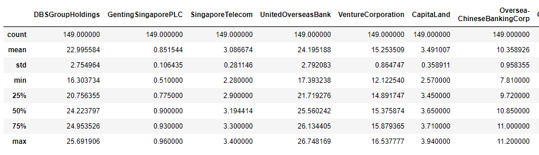
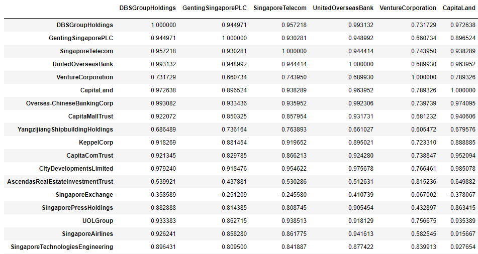
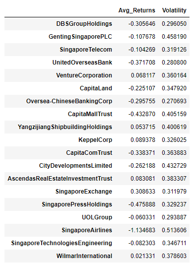
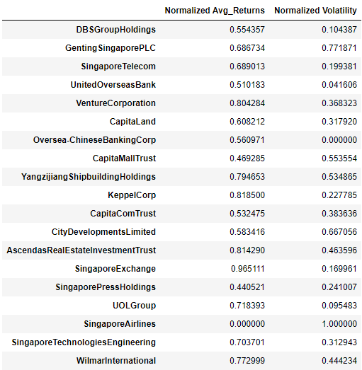
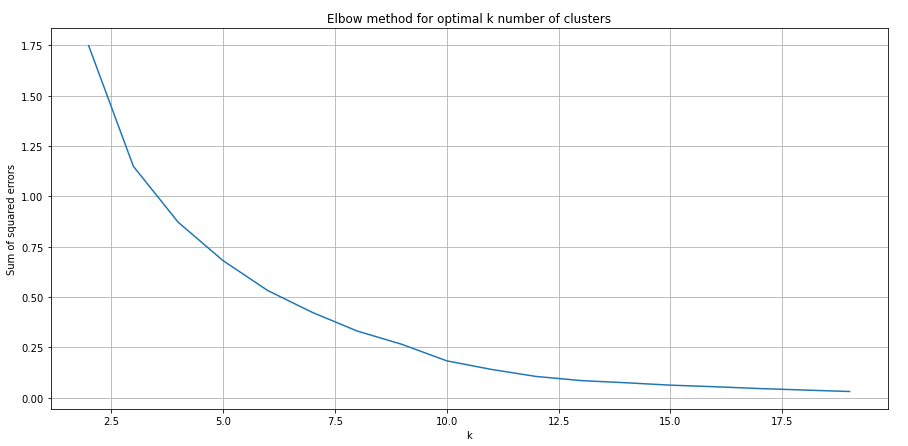
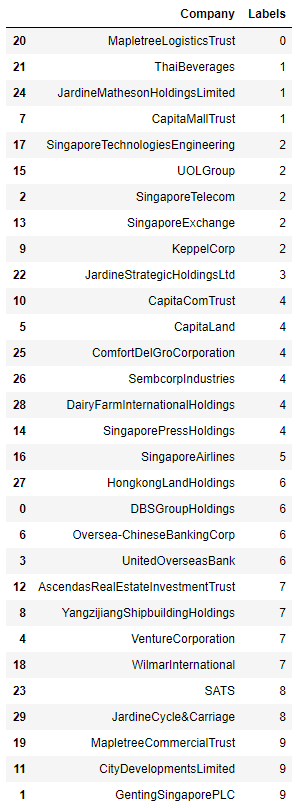

# STI Constituents Clustering
Clustering of STI constituents using k-means

### Cluster Anaylsis
The aim of this model is to observe how the various constituents of the STI move together based on Q4/2019 and Q1/2020 data through cluster analysis.

Cluster analysis can be used to help build diversified trading portfolios, since stocks that exhibit high correlations usually fall into the same basket/portfolio.

The intention here is to have 'baskets' of stocks that are diversified enough (**exhibiting minimal correlation from one another**) to protect the investor against systemic/market risks. Hence, I wanted to take a further look into the constituents of the STI to see if they could be further seperated into different 'baskets', instead of following the index in its entirety. 

### Getting the data
After obtaining the tickers of the 30 stocks within the STI, Q4/2019 and Q1/2020 data was obtained from Yahoo Finance throuhg the pandas.datareader module. For this project, only the Adjusted Closing prices of each stock was used for analysis.

```python
#Getting the historical data for the 30 stocks
stidf = pd.read_csv('sti.csv')
tickers = stidf['Symbol'].tolist()
names = stidf['Name'].tolist()
df = dr.DataReader(tickers,'yahoo',start = '2019-10-01', end='2020-04-30')['Adj Close']
```

Fortunately, our data has no empty values, so no data cleaning is required.

### Exploring the data
```python
#Replace tickers with company names
df.columns = stidf['Name'].tolist()

#Some exploratory analysis of the data
df.head()
df.describe()
```


### Correlation Matrix
A correlation matrix will also tell us how the closing prices of the stocks move in relation to one another, since the correlation coefficient is a measure of strength of that relationship. 

```python
#correlation matrix
corrMatrix = df.corr()
corrMatrix
```


Interestingly, certain stocks I assumed to have strong correlations with one another turned out to have weak relationships. The Singapore Exchange (S68.SI) also seemed to have negative correlations with a significant number of other constituents. However, most constituents that belonged to the same sector tended to showcase strong correlations (etc. DBS, UOB, OCBC).

### Calculating average return and price volatility
For this scenario, I decided to calculate 2 factors to be included in the k-means algorithm later, namely average returns (in %) and the volatility based on adjusted closing prices for each of the constituents. 

```python
#Using average percentage return of the adjusted closing prices of Q4/2019 & Q1/2020 then extraploate that to a one year period
#Calculate stock volatility -> sqrt(252)*sqrt(variance)
avg_returns = df.pct_change().mean()*252
vol =df.pct_change().std()*sqrt(252) 
data = pd.DataFrame()
data['Avg_Returns'] = avg_returns
data['Volatility'] = vol
```



From the data above, most of the constituents have seen negative average returns for the last 2 quarters which was not surprising, especially due to the market turmoils due to the ongoing coronavirus pandemic. One particular constituent, Singapore Airlines, has been severely affected by the current situation, with the largest change in average return and price volatility. 

### Normalization
However, it is important to note that not all constituents are equal. Some companies have much larger ranges in terms of their stock prices. Additionally, a 1% change in stock price is not equal for all constituents. Hence, normalization of the 2 variables is required in order to bring them to the same ranges without distorting any of their differences. More information on normalization can be found [here.](https://medium.com/@swethalakshmanan14/how-when-and-why-should-you-normalize-standardize-rescale-your-data-3f083def38ff)

Here, I used a MinMaxScaler from the scikitlearn to help transform the features into a specified range. The documentation on it can be found [here.](https://scikit-learn.org/stable/modules/generated/sklearn.preprocessing.MinMaxScaler.html)

```python
#Since the price ranges for various stocks differs, there is a need for normalization, using MinMaxScaler
scaler = MinMaxScaler()
norm_data = scaler.fit_transform(data)

#new normalized DataFrame of the constituents
norm_df = pd.DataFrame(norm_data, columns = ['Normalized Avg_Returns', 'Normalized Volatility'], index = names)
```


### K-Means Clustering
Lastly, we arrive at our clustering step. Given the normalized average returns and volatility of the constituents, we first use the elbow method to help us determine our ideal number of clusters that we want to seperate the constituents into. The elbow method is a commonly utilized method to help determine the optimal number of clusters that should be used for our model. More information on the elbow method can be found [here.](https://www.datanovia.com/en/lessons/determining-the-optimal-number-of-clusters-3-must-know-methods/)

```python
#Using elbow method to determine optimal number of clusters for our model
sum_sq_errors = []
K = range(2,20)
for k in K:
    km = KMeans(n_clusters = k)
    km.fit(norm_df)
    sum_sq_errors.append(km.inertia_)
```

The code above specifies a range of 2-20 clusters, before running each variation and appending it to the list of sum of squared errors. Ideally, we want to select an optimal *k* number of clusters where the reduction of sum of squared errors (SSE) sees little to no further change.

```python
#Plotting the results to identify ideal n number of clusters
fig = plt.figure(figsize=(15, 7))
plt.plot(range(2, 20), sum_sq_errors)
plt.grid(True)
plt.title('Elbow method for optimal k number of clusters')
plt.xlabel('k')
plt.ylabel('Sum of squared errors')
```



From the graph above, the reduction in SSE tapers off at around *k* = 10, so we will use that for our number of clusters that we want to specify. This means that out of the 30 constituents of the STI, the k-means algorithm will divide them into 10 groups. Note that it is not necessary for all groups to share the same amount of constituents.

```python
#Reduction in SSE tapers off at around 10, which will be our number of centroids
#Creating a KMeans model
kmeans = KMeans(n_clusters = 10,max_iter = 1000)

#Creating a pipeline with the kmeans function, then fitting our normalized data
pipeline = make_pipeline(kmeans)
pipeline.fit(norm_df)

#predicting the labels
labels = pipeline.predict(norm_df)

#printing result
result = pd.DataFrame({'Company':list(norm_df.index),'Labels':labels}).sort_values(by = 'Labels', axis=0)
```


The results above show the 10 different groups that split the STI constituents. Each label indicates the group that a particular company belongs to. Interestingly, Mapletree Logistics Trust,Jardine Strategic Holdings Ltd and Singapore Airlines are the sole constituents in their particular group. 

### Further improvements
To further improve this model, the following can be done:

1. Since the constituents are not independent of all SGX listed stocks, it would be wise to include **all** SGX listed stocks into this model.
2. A longer timeframe of closing prices could be considered.
3. Other forms of measurement beyond average returns and volatiity can be considered.

Feedback for this project is greatly appreciated!
